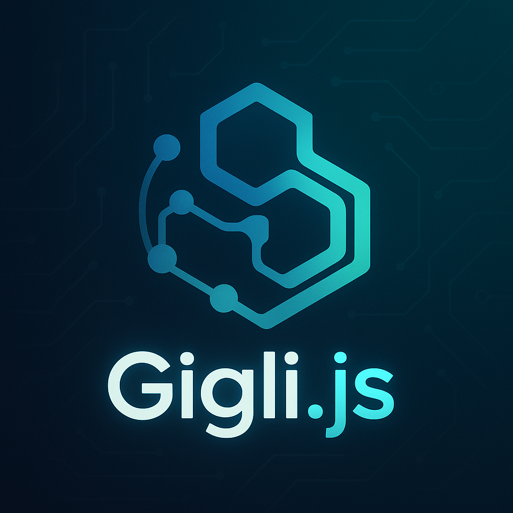

<div align="center">
  
  <h1>Gigli.js</h1>
  <p><b>Metamorphic, type-safe validation engine for TypeScript & JavaScript</b></p>
  <p>
    <a href="https://www.npmjs.com/package/gigli.js"></a>
    <a href="https://img.shields.io/npm/dm/gigli.js?style=flat-square"></a>
    <a href="https://bundlephobia.com/result?p=gigli.js"></a>
    <a href="https://github.com/jasgigli/gigli.js/actions/workflows/ci.yml"></a>
    <a href="https://codecov.io/gh/jasgigli/gigli.js"></a>
    <a href="https://github.com/jasgigli/gigli.js/blob/main/LICENSE"></a>
    <a href="https://www.npmjs.com/package/gigli.js"></a>
    <a href="https://github.com/jasgigli/gigli.js/pulls"></a>
  </p>
  <p>
    <b>Unified runtime, builder, decorator, and string rule support. Generate OpenAPI/JSON Schema. Use in Node.js, React, Express, NestJS, and more.</b>
  </p>
</div>

---

# 🚀 Why Gigli.js?

Gigli.js is not just another validator. It's a <b>metamorphic engine</b> that adapts to your coding style—builder, decorator, or string rules—without sacrificing type safety, power, or extensibility.

- 🧩 <b>Unified API</b>: Mix & match builder, decorator, and string rules
- 🦾 <b>Type Inference</b>: Full TypeScript support, everywhere
- 🛠️ <b>Extensible</b>: Custom rules, transformers, and definitions
- 🔍 <b>Detailed Error Tracing</b>: See exactly why validation failed
- 🏗️ <b>Schema Generation</b>: OpenAPI & JSON Schema out of the box
- ⚡ <b>Zero dependencies</b>, works in Node.js, browsers, and modern runtimes

---

# 📦 Installation

```bash
npm install gigli.js
```

---

# 🏁 Quick Start

```typescript
import { v } from 'gigli.js';

const UserSchema = v.object({
  username: v.string().min(3),
  email: v.string().email(),
});

const result = UserSchema.safeParse({ username: 'bob', email: 'bob@email.com' });
console.log(result.success); // true
```

---

# 🌱 Progressive Examples

## 1️⃣ Basic Validation

```typescript
import { v } from 'gigli.js';

const UserSchema = v.object({
  username: v.string().min(3),
  email: v.string().email(),
});

UserSchema.parse({ username: 'ab', email: 'bad' }); // Throws with detailed error
```

## 2️⃣ Type Inference

```typescript
type User = v.infer<typeof UserSchema>;
// User: { username: string; email: string }
```

## 3️⃣ Error Handling & Flattening

```typescript
try {
  UserSchema.parse({ username: 'ab', email: 'bad' });
} catch (err) {
  console.log(err.flatten());
  /*
  {
    input: { username: 'ab', email: 'bad' },
    errors: [
      { path: ['username'], message: 'String must be at least 3 characters' },
      { path: ['email'], message: 'Invalid email address' }
    ]
  }
  */
}
```

## 4️⃣ Advanced Builder Features

```typescript
const PostSchema = v.object({
  id: v.string().uuid(),
  title: v.string().min(5).max(100),
  tags: v.array(v.string().min(2)).optional(),
  author: UserSchema, // Schemas are composable!
  status: v.string().from('enum:values=draft|published|archived'),
  meta: v.union([
    v.object({ type: v.literal('text'), content: v.string() }),
    v.object({ type: v.literal('image'), url: v.string().url() })
  ])
});
```

## 5️⃣ Nested Objects, Arrays, Optionals, Enums

```typescript
const BlogSchema = v.object({
  posts: v.array(PostSchema),
  owner: v.object({
    id: v.string().uuid(),
    name: v.string(),
    roles: v.array(v.string().from('enum:values=admin|editor|user')),
  }),
  settings: v.object({
    commentsEnabled: v.boolean().optional(),
    theme: v.string().default('light'),
  })
});
```

## 6️⃣ Decorator API (for OOP & NestJS fans)

```typescript
import { v, ValidatedModel } from 'gigli.js';

@v.Refine((dto) => dto.password === dto.passwordConfirm, {
  message: "Passwords don't match",
  path: ['passwordConfirm'],
})
class CreateUserDto extends ValidatedModel {
  @v.Rule(v.string().email())
  email: string;

  @v.Rule('string:min=8,max=50')
  password: string;

  @v.Rule(v.string())
  passwordConfirm: string;
}

const userDto = CreateUserDto.from({
  email: 'foo@bar.com',
  password: 'secret123',
  passwordConfirm: 'secret123',
});
```

## 7️⃣ Pipeline API (for complex workflows)

```typescript
const OrderPipeline = v.pipeline()
  .transform((data) => ({ ...data, orderId: data.id.toLowerCase() }))
  .validate(v.object({ orderId: v.string().min(1) }))
  .dispatch('paymentMethod', {
    'credit_card': v.object({ card: v.string().creditCard() }),
    'paypal': v.object({ email: v.string().email() }),
  })
  .refine((order) => order.total > 0, { message: 'Order total must be positive' })
  .effect({
    onSuccess: (data) => console.log('Order Validated', data.orderId),
    onFailure: (trace) => console.error('Order Failed', trace),
  });

const result = OrderPipeline.safeParse(orderData);
```

## 8️⃣ Custom Rules, Transformers, and Definitions

```typescript
v.registerRule('isEven', (value) => typeof value === 'number' && value % 2 === 0);
v.registerTransformer('trim', (value) => typeof value === 'string' ? value.trim() : value);
v.define('slug', 'string:min=3|regex:^[a-z0-9-]+$');

const SlugSchema = v.string().from('slug').transform('trim');
```

---

# 🧑‍💻 CLI Usage

```sh
npx gigli codegen --schema ./src/schemas.ts --target openapi
npx gigli codegen --schema ./src/schemas.ts --target jsonschema
npx gigli analyze --schema ./src/schemas.ts
npx gigli --help
```

---

# 🏆 Feature Comparison

| Feature                        | Zod | Yup | class-validator | <b>Gigli.js</b> |
|-------------------------------|:---:|:---:|:--------------:|:--------------:|
| Type Inference                 | ✅  | ❌  | ✅             | ✅             |
| Chainable Schema Builder       | ✅  | ✅  | ❌             | ✅             |
| Decorator API                  | ❌  | ❌  | ✅             | ✅             |
| Portable String Rules          | ❌  | ❌  | ❌             | ✅             |
| Unified Runtime (Mix & Match)  | ❌  | ❌  | ❌             | ✅             |
| Validation Pipelines & Dispatch| ❌  | ❌  | ❌             | ✅             |
| Detailed Error Tracing         | ❌  | ❌  | ❌             | ✅             |
| Auto OpenAPI/JSON Schema Gen   | ❌  | ❌  | ❌             | ✅             |
| Extensible (Rules/Transformers)| ⚠️  | ⚠️  | ⚠️             | ✅             |

---

# 🌍 Use It Everywhere

- Node.js, Deno, Bun, Cloudflare Workers
- React, Vue, Svelte, Solid
- Express, NestJS, tRPC, REST, GraphQL
- Works in browsers and modern runtimes

---

# 🔗 Documentation & Resources

- 📖 <b>[Full Usage Guide](docs/USAGE.md)</b>
- 🧩 <b>API Reference</b>: See above and in-code docs
- 💡 <b>Examples</b>: [examples/](examples/)
- 📝 <b>[Contributing Guide](CONTRIBUTING.md)</b>
- 🐞 <b>[Report Issues](https://github.com/jasgigli/gigli.js/issues)</b>
- 📦 <b>[NPM Package](https://www.npmjs.com/package/gigli.js)</b>
- ⚖️ <b>[License (MIT)](LICENSE)</b>

---

# 🤝 Contributing

We are building the future of data validation, and we'd love your help! Please read our <b>[CONTRIBUTING.md](CONTRIBUTING.md)</b> to get started. Whether it's a bug report, a new feature, or a documentation improvement, all contributions are welcome!

---

# 🪪 License

Gigli.js is open-source software licensed under the <b>MIT License</b>.

---

# 🏷️ Keywords

validation, validator, typescript, schema, zod, yup, class-validator, openapi, jsonschema, decorators, cli, nodejs, react, express, nestjs, type-safe, builder, portable, runtime, inference, extensible, pipeline, unified, metamorphic

## Usage

### ESM (Node.js with `"type": "module"` or `.mjs` files)

```js
import { v } from 'gigli.js';

const UserSchema = v.object({
  username: v.string().min(3),
  email: v.string().email(),
});

(async () => {
  const result = await UserSchema.safeParse({ username: 'bob', email: 'bob@email.com' });
  console.log('safeParse:', result); // { success: true, data: ..., error: null }
  try {
    const parsed = await UserSchema.parse({ username: 'bob', email: 'bob@email.com' });
    console.log('parse:', parsed); // { username: 'bob', email: 'bob@email.com' }
  } catch (err) {
    console.error('parse error:', err);
  }
})();
```

---

### CommonJS (default Node.js or `.js` files)

```js
const { v } = require('gigli.js');

const UserSchema = v.object({
  username: v.string().min(3),
  email: v.string().email(),
});

(async () => {
  const result = await UserSchema.safeParse({ username: 'bob', email: 'bob@email.com' });
  console.log('safeParse:', result); // { success: true, data: ..., error: null }
  try {
    const parsed = await UserSchema.parse({ username: 'bob', email: 'bob@email.com' });
    console.log('parse:', parsed); // { username: 'bob', email: 'bob@email.com' }
  } catch (err) {
    console.error('parse error:', err);
  }
})();
```

---

### TypeScript

TypeScript types are included automatically. You can use the same import as ESM:

```ts
import { v } from 'gigli.js';
// ...rest of your code
```

---

### API

- `schema.safeParse(data)` — Returns `{ success, data, error }`. Does not throw.
- `schema.parse(data)` — Returns parsed data or throws on error.

Both methods are **async** and must be awaited.
